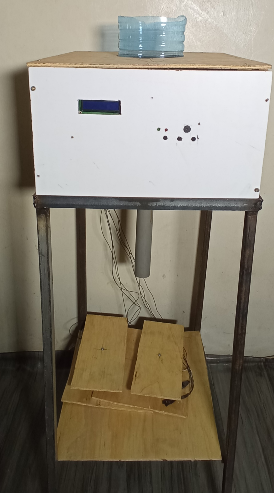
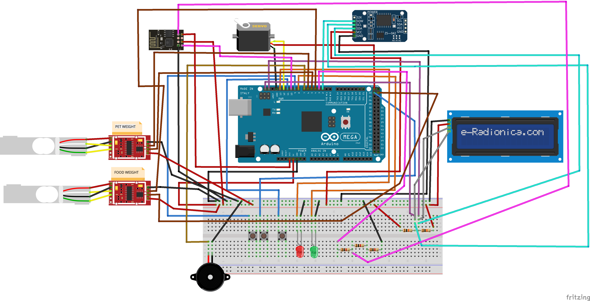
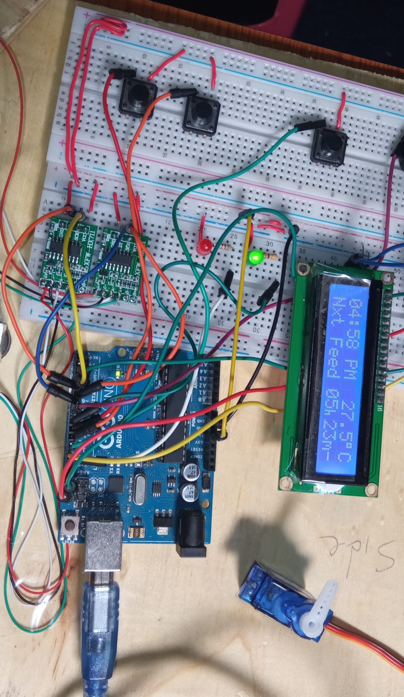
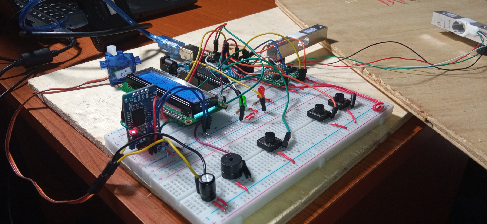
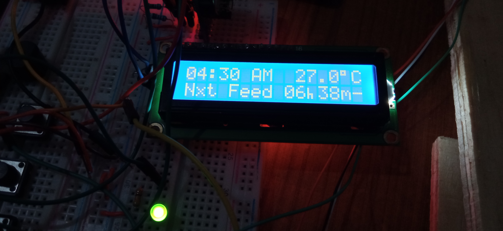
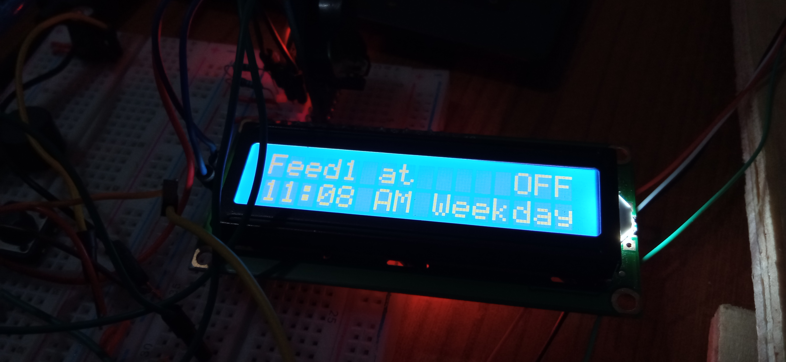
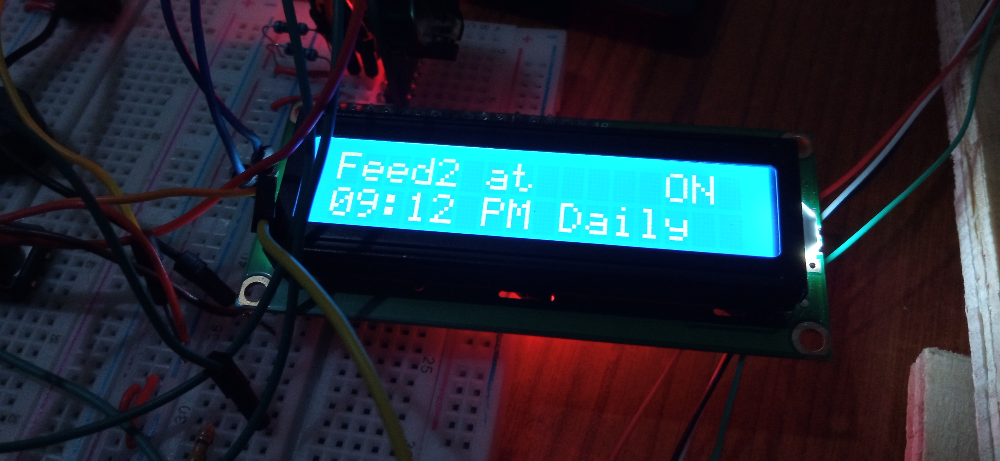

# AUTOMATIC FOOD DISPENSER FOR PETS


---

 <br>

---

## Table of Contents
---
 * [Abstract](https://github.com/Bernitarist/AUTOMATIC-FOOD-DISPENSER-FOR-PETS#abstract)
 * [Hardware Components](https://github.com/Bernitarist/AUTOMATIC-FOOD-DISPENSER-FOR-PETS#hardware-components)
 * [How it Works](https://github.com/Bernitarist/AUTOMATIC-FOOD-DISPENSER-FOR-PETS#how-it-works)
   * [Flowchart](https://github.com/Bernitarist/AUTOMATIC-FOOD-DISPENSER-FOR-PETS#flowchart)
   * [Circuit Schematic](https://github.com/Bernitarist/AUTOMATIC-FOOD-DISPENSER-FOR-PETS#circuit-schematic)
   * [Breadboard Assembly](https://github.com/Bernitarist/AUTOMATIC-FOOD-DISPENSER-FOR-PETS#breadboard-assembly)
   * [The Display](https://github.com/Bernitarist/AUTOMATIC-FOOD-DISPENSER-FOR-PETS#the-display) 
   * [Brief Code Explanation](https://github.com/Bernitarist/AUTOMATIC-FOOD-DISPENSER-FOR-PETS#brief-code-explanation)
 * [License](https://github.com/Bernitarist/AUTOMATIC-FOOD-DISPENSER-FOR-PETS#license) 
 * [Contact](https://github.com/Bernitarist/AUTOMATIC-FOOD-DISPENSER-FOR-PETS#contact)<br><br>

## [Abstract](#heading-3)

Existing pet food-dispensers provide minimal adaptability, functionality and user personalization, leading to overfeeding or underfeeding of the pets. This project aims at solving the problems faced by pet owners by allowing them to customize the time interval between feeding times. <br><br>The device will dispense food based on the pet's weight, thereby allowing the right amount of food for each pet. Feedback from the pet is also incorporated. The corresponding feed information is sent to a database to be accessed by the owner, allowing them to plan efficiently. 
 <br> 

## [Hardware components](#heading-3)

| **Component**                        | **Photo**                                                                       |
| ------------------------------------ | ------------------------------------------------------------------------------- |
| Liquid Crystal Display / LCD adapter |   |
| ESP 8266-01                          |                                           |
| Servo motor SG90                     |                                         |
| Arduino Mega 2560                    |                                          |
| Load Cell / HX711 (2 pcs)            |                                      |
| RTC DS3231                           |                                           |
| Push Buttons (3 pcs)                 |                                          |

<br>

## [How it Works](#heading-3)
  
 * The owner will set the preferred feeding times
 * On arrival of the specified time the buzzer will be triggered as an alert to the pet
 * Detection of the pet occurs by measuring its weight 
 * The buzzer goes off and the feeder-door is opened to release the corresponding food amount; based on the pet's weight
 * The feeder door is closed and the device starts over
 * The pet's weight and the food consumed is sent to a database for monitoring <br><br>

   * ### **Flowchart**
     ---

     <br><br>

   * ### **Circuit Schematic**
     ---
      <br><br> 

   * ### **Breadboard Assembly**
     ---
      <br><br> 
      <br><br>

   * ### **The Display**
     ---
     _A sample of the display showing the current time and time till the next feed_

      

     _A sample of the display showing the first feed time_

     

     _A sample of the display showing the second feed time_

     <br><br>
    
   * ### **Brief Code Explanation**
     ---
    This section highlights the main functions used in the project code.<br> 
  * The code begins by including all the necessary libraries.

    ```c++
    #include <SimpleAlarmClock.h>         
    #include <LiquidCrystal_I2C.h>
    #include <SoftwareSerial.h>
    #include <Button.h>
    #include <Servo.h>   
    #include "HX711.h"                 
    #include "pitches.h"
    
    ```
    The _SimpleAlarmClock.h_ library can be found [here](https://github.com/rmorenojr/SimpleAlarmClock "SimpleAlarmClock") and is used as the main clock library for the project. In order to use the library together with the push buttons, we include a library
    to control the button action, which is found [here](https://github.com/rmorenojr/Button "Button").
    The _pitches.h_ library controls the buzzer tone and interval during its ringing times. The library is found [here](https://github.com/arduino/arduino-examples/blob/main/examples/02.Digital/toneMelody/pitches.h "Pitches").<br>
    
  * Below is a function that checks the feeder plate for food. On detection of any pre existing food in the plate, the device will not release more food.

    ```c++
     bool checkPlate(){
      while((scale.get_units(5)) > 60){  //if food is in plate
        door.write(minAngle);  //do not open feeder door
         }
         return true;
         }   
    ```
   * To check the presence of the pet
        
        ```c++
            void checkAnimal(){
  
                if((pWeight.get_units(5)) > 30){  //if pet is detected
                       animalPresent = true;
                   }

                if(animalPresent == true){
                     Snooze();                   //stop the buzzer
                     ClockState = DoorOpening;  //open feeder door
                    }

                }          
       ```
   * The basis of releasing food depends on the opening and closing of the feeder door. The functions responsible are provided below
   
     ```c++
        void openDoor(){

        bool plateEmpty;
    
         lcd.clear();
         lcd.setCursor(0,0);
         lcd.print("Feeding...");

         if((scale.get_units(5)) <= 60){
         door.write(maxAngle);
         counter++;
         plateEmpty = true; 
             }
         if((scale.get_units(5)) > 70) {   
         plateEmpty = checkPlate();
         door.write(maxAngle);
         counter++;
        }
          if (plateEmpty == true){
                     //give different amounts of food depending on the pet weight
              if((pWeight.get_units(5)) > 1 && (pWeight.get_units(5)) <= 100){
                 petWeight = String(pWeight.get_units(5));
                 closeDoor(0);
              }
              if((pWeight.get_units(5)) > 100 && (pWeight.get_units(5)) <= 250){
                 petWeight = String(pWeight.get_units(5));
                 closeDoor(1);
              }
              if((pWeight.get_units(5)) > 250 && (pWeight.get_units(5)) <= 350){
               petWeight = String(pWeight.get_units(5));
                closeDoor(2);
              }
              if((pWeight.get_units(5)) > 350 && (pWeight.get_units(5)) <= 500){
                petWeight = String(pWeight.get_units(5));
                closeDoor(3);
                  }
               }
            }

     ```

        ```c++
            void closeDoor(int animalWeight){

               int tracker;  //to track amount of food remaining

                  switch (animalWeight){
                 case 0:
                    while((scale.get_units(5)) <= 140){
                        lcd.setCursor(0,1);
                        lcd.print(Amt2Digits(scale.get_units(5)));
                        lcd.print(" g");            
                        door.write(maxAngle); //open door
                                 }
                     tracker = feedTracker(scale.get_units(5));
                     feedWeight = String(scale.get_units(5));
                     door.write(minAngle);
                     animalPresent = false;
                     ClockState = Posting;
                 break;
                 case 1:
                    while((scale.get_units(5)) <= 280){
                        lcd.setCursor(0,1);
                        lcd.print(Amt2Digits(scale.get_units(5)));
                        lcd.print(" g");
                        door.write(maxAngle);
                              }  
                     tracker = feedTracker(scale.get_units(5));
                     feedWeight = String(scale.get_units(5));
                     door.write(minAngle);
                     animalPresent = false;
                      ClockState = Posting;
                  break;
                  case 2:
                      while((scale.get_units(5)) <= 420){
                          lcd.setCursor(0,1);
                          lcd.print(Amt2Digits(scale.get_units(5)));
                          lcd.print(" g");
                          door.write(maxAngle);
                                 }
                       tracker = feedTracker(scale.get_units(5));
                       feedWeight = String(scale.get_units(5));
                       door.write(minAngle);
                       animalPresent = false;
                       ClockState = Posting;
                   break;
                   case 3:
                       while((scale.get_units(5)) <= 570){
                           lcd.setCursor(0,1);
                           lcd.print(Amt2Digits(scale.get_units(5)));
                           lcd.print(" g");
                           door.write(maxAngle);
                               }
                       tracker = feedTracker(scale.get_units(5));
                       feedWeight = String(scale.get_units(5));
                       door.write(minAngle);
                       animalPresent = false;
                       ClockState = Posting;
                   break;

                   default:     
                   break;
                 }
             }
        ```
   * Once feeding is done, the corresponding information is sent to a database. This will enable the pet owner to plan efficiently for future pet needs. Below is the function responsible for this:
        
        ```c++
            void httppost(){

                  String postrequest;

                     esp.println("AT+CIPSTART=\"TCP\",\""+SERVER +"\",80");// start a TCP connection
                     delay(2000);
                         if(esp.find("OK")){
                            lcd.clear();
                            lcd.setCursor(0,0);
                            lcd.print("TCP conn ready");   
                            }
                     delay(1000);  
                 postrequest=
                  "POST " + URI + " HTTP/1.0\r\n" + "Host: " + SERVER + "\r\n" +
      
                  "Accept: *" + "/" + "*\r\n" + "Content-Length: " + data.length() + "\r\n" +
      
                  "Content-Type: application/x-www-form-urlencoded\r\n" +
      
                  "\r\n" + data;
               String sendCmd = "AT+CIPSEND=";//determine the number of caracters to be sent.
               esp.print(sendCmd);
               esp.println(postrequest.length() );
               delay (1000);

                         if(esp.find(">")) {
                             lcd.clear();
                             lcd.setCursor(0,0);
                             lcd.print("Sending..");

                             esp.print(postrequest);
                             delay(2000);
  
                                if( esp.find("SEND OK")) {
                                    delay(2000);
                                    lcd.clear();
                                    lcd.setCursor(0,0);
                                    lcd.print("Packet sent");

                                         while (esp.available()) {
                                             String tmpResp = esp.readString();

                                               }
                                    esp.println("AT+CIPCLOSE");   // close the connection
                                    ClockState = ShowClock;
                                        }
                                       }
                                      }
        ```

Click [this](https://github.com/Bernitarist/AUTOMATIC-FOOD-DISPENSER-FOR-PETS/tree/master/Code "Full Code") link to view the full code.

## [License](#heading-3)

This project is licensed under the MIT license. Feel free to edit and distribute this template as you like. <br><br> See [LICENSE](https://github.com/Bernitarist/AUTOMATIC-FOOD-DISPENSER-FOR-PETS/blob/master/LICENSE "MIT") for more information.    

## [Contact](#heading-3)

> [Email](berniemukonesi@gmail.com "berniemukonesi@gmail.com") - berniemukonesi@gmail.com  <br>
> [Phone](+254713187640 "+254 713187640") <br>
> [LinkedIn](https://www.linkedin.com/in/bernice-mukonesi-a9410618a "linkedin.com/in/bernice-mukonesi-a9410618a") <br>


