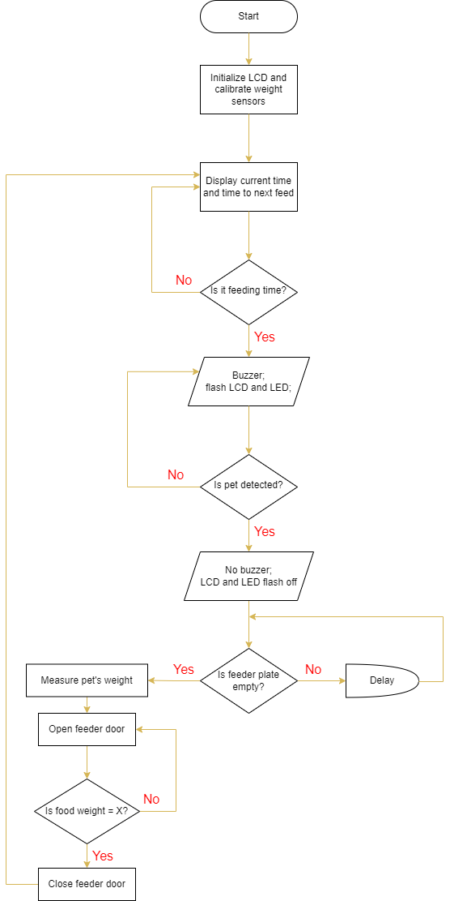

# AUTOMATIC-FOOD-DISPENSER-FOR-PETS

---
## Table of Contents
---

## [Abstract](#heading-3)

 Existing pet food-dispensers provide minimal adaptability, functionality and user personalization, leading to overfeeding or underfeeding of the pets. This project aims at solving the problems faced by pet owners by allowing them to customize the time interval between feeding times.   The device will dispense food based on the pet's weight, thereby allowing the right amount of food for each pet. Feedback from the pet is also incorporated. The corresponding feed information is sent to a database to be accessed by the owner, allowing them to plan efficiently. 

## [Hardware components](#heading-3)

| **Component**                            |      **Photo**                                                              |
| ------------------------------------ | ------------------------------------------------------------------------------- |
| Liquid Crystal Display / LCD adapter |   |
| ESP 8266-01                          |                                           |
| Servo motor SG90                     |                                         |
| Arduino Mega 2560                    |                                          |
| Load Cell / HX711 (2 pcs)            |                                      |
| RTC DS3231                           |                                           |
| Push Buttons (3 pcs)                 |                                          |

## [How it Works (Flowcharts)](#heading-3)
  
 * The owner will set the preferred feeding times
 * On arrival of the specified time the buzzer will be triggered as an alert to the pet
 * Detection of the pet occurs by measuring its weight 
 * The buzzer goes off and the feeder-door opened to release the corresponding food amount, based on the pet's weight
 * The feeder door is closed and the device starts over
 * The pet's weight and the food consumed is sent to a database for monitoring   

   * ### Main Flowchart
     --- 
       

    * ### LCD Flowchart 
      ---
